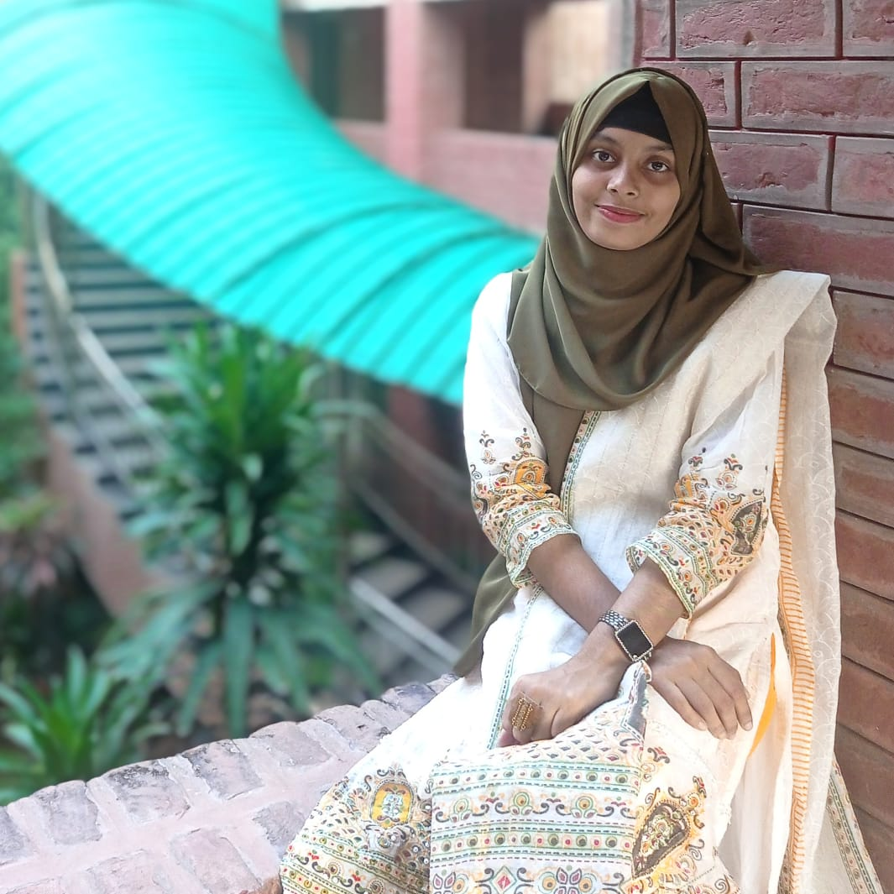

## *PROFILE PICTURE*

  

## *PROFILE*
A Computer Science and Engineering undergraduate at Jahangirnagar University, passionate about web development, research, and thesis publication. Dedicated to creating impactful web solutions and contributing to the academic community through innovative ideas. Always eager to learn and grow in the tech world.

## *EDUCATION*

*Bachelor of Science in Computer Science and Engineering*  
- *Institution*:  Jahangirnagar University  
- Expected Graduation: 2026 

*Higher Secondary Certificate (HSC)*  
- *Institution*: Narayanganj College 
- *Year*: 2018–2020  
- *Grade*: GPA 5.0/5.0  

*Secondary School Certificate (SSC)*  
- *Institution*: Muktijoddha Smrity Biddyaniketon  
- *Year*: 2016–2018  
- *Grade*: GPA 5.0/5.0  

<!-- ## *EXPERIENCE*
*Private Tutoring*  
Provided personalized academic support through private tuition, focusing on simplifying complex topics and fostering a deep understanding among students. -->

## *LANGUAGES*
- English: Fluent
- Bangla: Native 

## *SKILLS*
- *Programming Languages*: C++, C  
- *Web Development*: HTML, CSS, JavaScript, Hugo  
<!-- - *Graphics*: OpenGL, GLUT   -->
- *Tools & Technologies*: Git, VS Code, GitHub, Git Bash  
- *Operating Systems*: Linux, Windows  

## *CONTACT ME*
- *Phone*: 01827582860 
- *Email*: [sayedakhadijarahman@gmail.com] 
- *Address*: Savar, Dhaka, Bangladesh
